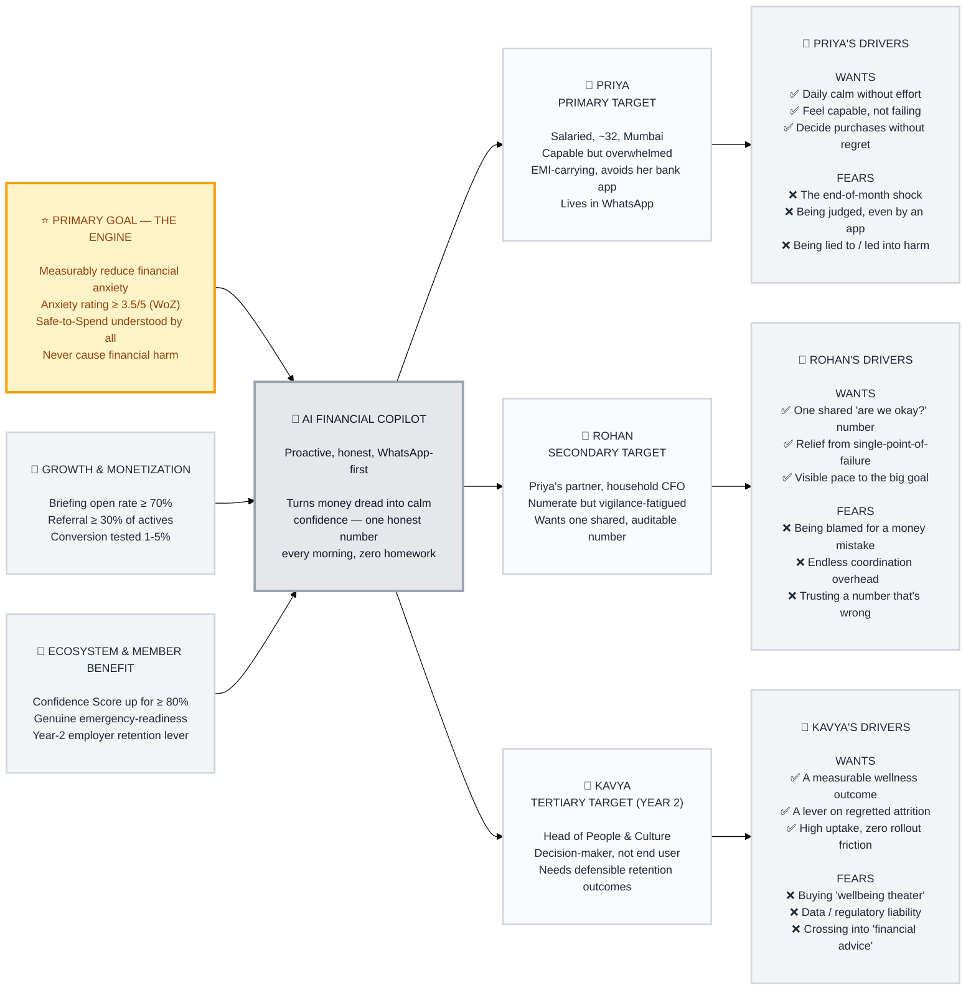

# Trigger Map — AI-Powered Personal Finance Analyzer

> Strategic North Star: connecting business goals to user psychology

**Document:** Trigger Map — Hub & Navigation
**Project:** AI Financial Copilot
**Created:** 2026-07-07
**Author:** ALPHA (facilitated by Saga, WDS Strategic Analyst)
**Method:** Whiteport Design Studio · Effect Mapping (Balic & Domingues, inUse)

---

## The Map

---

## Summary

**Primary Target:** **Priya — The Overwhelmed Earner.** One-line transformation: *from money-avoider braced for the end-of-month shock → to a quietly confident person who greets a calm, honest morning briefing.*

**Key Transformation:**
> The AI Financial Copilot turns financial confusion into financial confidence — replacing avoidance (the real competitor) with a proactive, honest voice that speaks first every morning, tells Priya exactly how much she can safely spend, and is transparent about what it doesn't know.

**The Flywheel:**
1. ⭐ **Empower Priya** → measurably reduce her anxiety (THE ENGINE — the WoZ go/no-go gate).
2. 🚀 **She becomes an advocate** → calm, trusting users form the daily habit and refer friends (34.92% of discovery is via friends), driving retention, referral, and revenue *without* buying growth.
3. 🌟 **Success creates ecosystem value** → users become genuinely prepared (Confidence up for ≥80%), and that proven outcome unlocks the Year-2 employer wellness channel (Kavya).

Everything traces back to one question: **does Priya's anxiety actually drop?**

---

## Detailed Documentation

### 📊 Business Strategy → [01-business-goals.md](01-business-goals.md)
Vision, SMART objectives across three priority tiers, the flywheel, and the regulatory/trust guardrails.

**On-page essentials:**
- **Vision:** Become the most trusted daily financial voice for anxious salaried Indians — turning money dread into calm confidence, and never causing harm through a wrong number.
- ⭐ **PRIMARY (THE ENGINE):** measurably reduce financial anxiety — WoZ gate: anxiety ≥ 3.5/5, Safe-to-Spend understood by 5/5, decrease by Day 30.
- 🚀 **GROWTH:** ≥70% briefing open rate · ≥30% referral · conversion tested at 1-5% · Day-7 retention ≥4/5.
- 🌟 **ECOSYSTEM:** Confidence Score up for ≥80% · Year-2 employer retention lever.
- **Kill signal:** one Safe-to-Spend error causing real harm → immediate pause + trust audit.

### 👥 Target Users

**⭐ [Priya — The Overwhelmed Earner](personas/02-priya-the-overwhelmed-earner.md)** — PRIMARY (THE ENGINE)
Salaried, ~32, Mumbai, EMI-carrying, capable but overwhelmed; avoids her bank app; lives in WhatsApp.
- **Wants:** ✅ daily calm without effort · ✅ feel capable · ✅ decide purchases without regret
- **Fears:** ❌ the end-of-month shock · ❌ being judged · ❌ being lied to / led into harm

**🚀 [Rohan — The Money-Managing Partner](personas/03-rohan-the-money-managing-partner.md)** — SECONDARY
Priya's partner, the household CFO; numerate but vigilance-fatigued; wants one shared, auditable number. The household multiplier who unlocks the Premium tier.
- **Wants:** ✅ one shared "are we okay?" number · ✅ relief from being the single point of failure · ✅ visible pace to the big goal
- **Fears:** ❌ being blamed for a money mistake · ❌ endless coordination overhead · ❌ trusting a number that's wrong

**🌟 [Kavya — The Workplace Wellness Sponsor](personas/04-kavya-the-wellness-sponsor.md)** — TERTIARY (Year 2)
Head of People & Culture; a decision-maker, not an end user; the Year-2 distribution multiplier who buys calm for hundreds of Priyas at once.
- **Wants:** ✅ a measurable wellness outcome · ✅ a lever on regretted attrition · ✅ high uptake, zero rollout friction
- **Fears:** ❌ "wellbeing theater" · ❌ data/regulatory liability · ❌ crossing into "financial advice"

### 🎯 Strategic Implications → [05-key-insights.md](05-key-insights.md)
Design implications by surface, emotional transformation goals, the design focus statement, and phased development.

**Key focus areas:**
- Honesty-under-uncertainty (Confidence % everywhere) is the moat — and scores a perfect 11/11 in feature impact.
- Conservative-by-default safety + ring-fenced commitments — the guarantee behind the kill signal.
- Trust-sequenced messaging: credentials → security → social proof → features.
- Multi-source data ingestion at MVP (only ~38% of borrowers are AA-enabled).

### 🧮 Feature Prioritization → [feature-impact-analysis.md](feature-impact-analysis.md)
Persona-weighted scoring (Priya 5/3/1, others 3/1/0) sorting every feature into Must Have / Consider / Defer. The two perfect-11 features are the honesty layer and trust-first onboarding — the thesis, made visible.

---

## How to Read This Map

- **Left → right = causal flow:** Business Goals drive the Platform, which serves Target Groups, whose Driving Forces the design must address.
- **Top → bottom = priority:** ⭐ Primary (gold) is THE ENGINE; 🚀 Secondary is driven by it; 🌟 Tertiary is the ecosystem benefit (Year 2).
- **Driving force symbols:** ✅ = a positive driver (a want to deliver on); ❌ = a negative driver (a fear to neutralize). Loss aversion means the ❌ fears are often the strongest design opportunities.
- **Design attention follows priority:** Priya gets the most; Rohan and Kavya are served by *extending* her experience, never by diluting it.

---

## Footer

_Produced with the **Whiteport Design Studio (WDS)** methodology, Phase 2: Trigger Mapping._
_Based on **Effect Mapping** by Mijo Balic & Ingrid Domingues (inUse) — adapted by WDS: simplified (goals-first, no premature features) and enhanced with explicit negative driving forces._
_Synthesized from the Complete Product Brief and six prior BMAD research sessions._

---

**Navigate:** [Business Goals](01-business-goals.md) · [Priya](personas/02-priya-the-overwhelmed-earner.md) · [Rohan](personas/03-rohan-the-money-managing-partner.md) · [Kavya](personas/04-kavya-the-wellness-sponsor.md) · [Key Insights](05-key-insights.md) · [Feature Impact](feature-impact-analysis.md)
