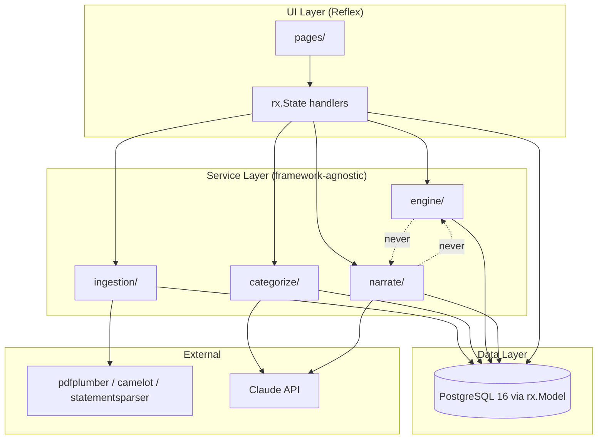
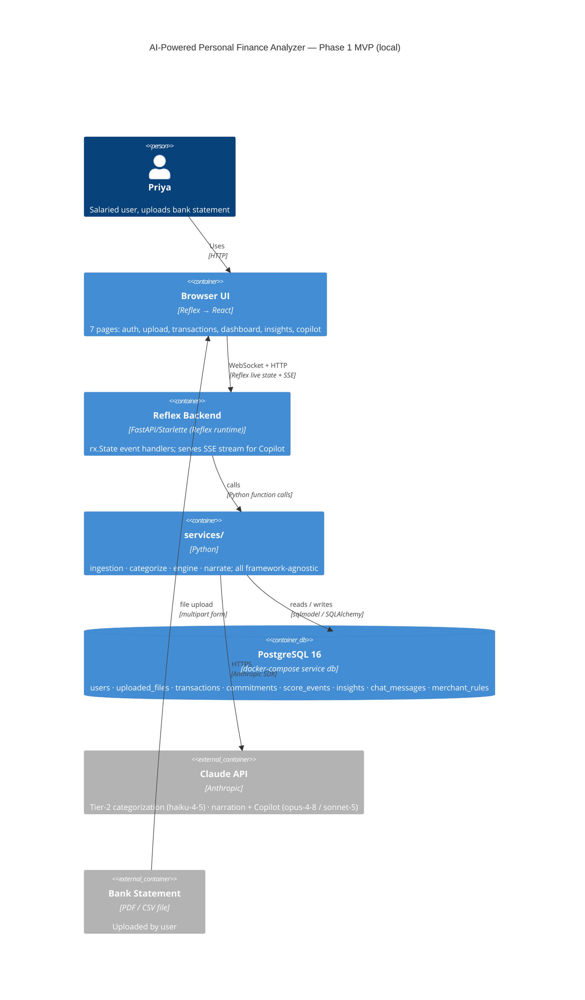
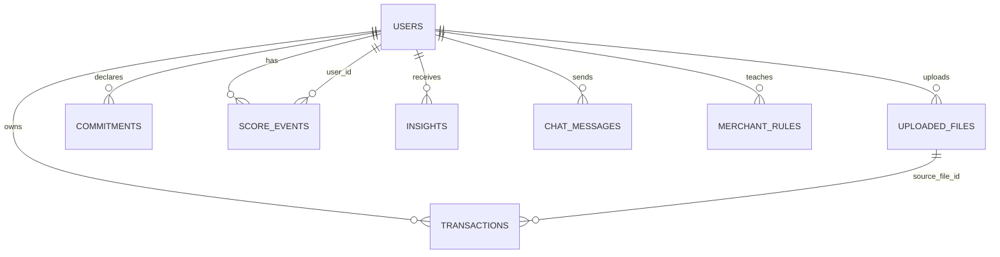

# Architecture Spine — AI-Powered Personal Finance Analyzer (Phase 1 MVP)

## Design Paradigm

**Layered modular monolith** with **ports-and-adapters** at the two external edges (statement parsers and LLM calls).

```
UI layer          Reflex pages + rx.State (orchestrate only; no logic)
Service layer     services/{ingestion, categorize, engine, narrate}/ — framework-agnostic Python
Data layer        rx.Model / sqlmodel → PostgreSQL 16 (psycopg2; Alembic migrations)
```

The engine/narrate split within the service layer is this project's load-bearing wall (see AD-1). The ports-and-adapters pattern at parsers (`StatementParser` protocol) and LLM callers (`Categorizer`/`Narrator` interfaces) keeps both edges mockable in tests and swappable for Phase 2 without touching business logic.



**Dependency direction rule:** UI → Service → Data. Horizontal (service-to-service) cross-calls are forbidden except through the Data layer. The engine/ and narrate/ sub-modules must never import each other (AD-1).

---

## Invariants & Rules

### AD-1 — Engine / Narrate hard boundary [ADOPTED]

- **Binds:** services/engine/, services/narrate/, FR-4, FR-5, NFR-1, NFR-3
- **Prevents:** LLM computing a financial figure (STS, CS, reservation amounts, shortfall) with no deterministic audit trail; prevents two units building the engine by letting LLM calls creep in
- **Rule:** `services/engine/` and `services/narrate/` must not import each other. The engine produces a typed evidence-pack struct; narrate receives that struct and calls the LLM only for language. No financial number may originate inside `services/narrate/`. This boundary is tested: engine unit tests must run with zero LLM calls.

### AD-2 — Service layer framework-agnosticism [ADOPTED]

- **Binds:** services/, E1–E9, NFR-6
- **Prevents:** business logic coupling to Reflex internals, making Phase 2 FastAPI extraction a rewrite instead of a lift
- **Rule:** No file under `services/` may import from `reflex` or any `rx.*` namespace. All `services/` functions accept and return plain Python types or sqlmodel models. Reflex `rx.State` event handlers are the only callers of service functions from the UI layer.

### AD-3 — Single state-mutation path [ADOPTED]

- **Binds:** services/engine/, rx.State dashboard handlers, FR-4.10, FR-9.4
- **Prevents:** two `rx.State` handlers computing diverging STS figures from the same underlying data (e.g. one via a direct formula, another via the engine)
- **Rule:** Financial state (STS, Confidence Score, commitment ring-fencing) is mutated exclusively by calling `services/engine/` functions. No `rx.State` handler may compute a financial figure inline. After any commitment add/edit/delete, the handler must call the engine and write the result back to the DB before yielding the UI update.

### AD-4 — User-id data isolation [ADOPTED]

- **Binds:** all DB queries, FR-1.4, NFR-5
- **Prevents:** cross-user data leakage (IDOR)
- **Rule:** Every DB query — read or write — in `services/` must include an explicit `user_id` filter. No query may return rows it cannot prove belong to the authenticated user. A dedicated test asserts that user A cannot read user B's transactions, commitments, or chat history. This test must pass before Phase 2.

### AD-5 — Auth token in httpOnly cookie only [ADOPTED]

- **Binds:** authentication, FR-1.1, NFR-5
- **Prevents:** XSS token theft; DPDP non-compliance
- **Rule:** The session token (from reflex-local-auth) must be set as an httpOnly, SameSite cookie. It must never be written to localStorage, sessionStorage, or a custom response header. Frontend JavaScript must not be able to read the token.

### AD-6 — Canonical transaction schema as the ingestion contract [ADOPTED]

- **Binds:** services/ingestion/, all parsers, services/categorize/, services/engine/, FR-2.3, FR-3.3
- **Prevents:** two parsers (CSV vs PDF) creating incompatible row shapes; downstream services forking on source format
- **Rule:** Every parser must normalize its output to the canonical `Transaction` schema before returning. No parser-specific shape may cross the boundary of `services/ingestion/`. The canonical schema fields are: `id, user_id, source_file_id, date, description_raw, merchant_normalized, amount, direction (credit|debit), balance_after, category, category_source (rule|llm|user), category_confidence, created_at`.

### AD-7 — Category enum hard-constraint [ADOPTED]

- **Binds:** services/categorize/, Tier-2 LLM categorization, FR-3.2
- **Prevents:** LLM inventing new category names that break downstream category-grouped queries; prompt injection via hostile merchant strings creating arbitrary categories
- **Rule:** The Tier-2 LLM categorization call must use a structured output (`messages.parse()` or `output_config.format json_schema`) with a Pydantic model whose `category` field is a `Literal` enum of the approved category list. Free-text category strings from the LLM are structurally impossible. The category enum is defined once in `services/categorize/schema.py` and imported by all callers.

### AD-8 — STS formula, floor, and rounding [ADOPTED]

- **Binds:** services/engine/safe_to_spend.py, FR-4.1, FR-4.6, NFR-1
- **Prevents:** any displayed STS figure that could cause a user to miss a committed obligation
- **Rule:** The STS formula is fixed:
  ```
  safe_to_spend_today = max(0, (available_balance − reserved_total − buffer) ÷ days_until_next_confirmed_income)
  ```
  `max(0, …)` is non-negotiable — STS is never negative. All STS figures are rounded **down** to the nearest ₹10 (use `math.floor(x / 10) * 10`). Rounding up is forbidden. The engine must return `safety_ok = True` only when every commitment due on or before next confirmed income is fully covered by the ring-fenced reserved_total.

### AD-9 — Score events as the score write path [ADOPTED]

- **Binds:** services/engine/confidence_score.py, score_events table, FR-5.3
- **Prevents:** a Confidence Score change reaching the UI without a traceable explanation; an unexplained score delta
- **Rule:** `services/engine/` must write a `score_events` row — containing `(score, delta, trigger_event, explanation, suggested_action, timestamp)` — atomically with every Confidence Score update. Column name is `trigger_event` (not `triggering_event`) — must match the data model exactly to avoid `AttributeError` in the CS-3 pytest assertion. The score shown in the UI is derived from the latest `score_events` row, not a bare score column. No code path may update the score without writing a matching event row.

### AD-10 — Copilot read-only tool contract [ADOPTED]

- **Binds:** services/narrate/copilot.py, FR-7.2, FR-7.3
- **Prevents:** the Copilot LLM performing write actions or computing financial figures independently
- **Rule:** The tool definitions passed to the Copilot LLM are strictly read-only: `get_safe_to_spend`, `get_confidence_score`, `query_transactions`, `get_spending_by_category`, `get_upcoming_commitments`. No write-capable function may appear in the tool list. Every tool implementation calls `services/engine/` or queries the DB read-only. The LLM system prompt must include the four hardcoded rules from FR-7.3 as non-configurable instructions.

### AD-11 — SSE event schema as the Copilot streaming contract [ADOPTED]

- **Binds:** Copilot endpoint, UI chat component, FR-7.4
- **Prevents:** client and server drifting on the streaming protocol; partial token / missing trace events reaching the UI
- **Rule:** The `/copilot/chat` endpoint emits exactly three SSE event types with these shapes — no others are valid:
  - `{ "type": "token", "text": "<string>" }`
  - `{ "type": "trace", "sources": [...] }`
  - `{ "type": "done" }`
  The client must handle all three and ignore unknown types gracefully (forward compatibility). The server must always emit a `done` event to close the stream.

### AD-12 — Parser failure is honest refusal [ADOPTED]

- **Binds:** services/ingestion/, UI upload page, FR-2.4, FR-2.9, NFR-1
- **Prevents:** silent wrong-row-count results or blank tables reaching the user
- **Rule:** Any parsing failure (scanned/image PDF, unrecognized layout, corrupt file, partial extraction) must raise a typed exception that the `rx.State` handler catches and surfaces as a plain-language user message. No exception from the ingestion pipeline may be swallowed silently. The UI must never display a transaction table with fewer rows than were actually parsed without an explicit caveat.

### AD-13 — Shared formatting utilities [ADOPTED]

- **Binds:** all currency and date display, NFR-7
- **Prevents:** two components displaying ₹1,25,000 and ₹125,000 for the same amount; non-standard date formats
- **Rule:** `formatINR(amount: float) -> str` (Indian number grouping: ₹1,25,000) and `formatDate(iso: str) -> str` (ISO date → "30 Jun 2026") are the only permitted currency and date display functions, defined in `services/utils/format.py`. Direct f-string formatting of currency or dates in components or State handlers is not acceptable.

### AD-14 — services/ as Phase 2 migration boundary [ADOPTED]

- **Binds:** entire services/ layer, NFR-6
- **Prevents:** the Phase 2 FastAPI extraction becoming a rewrite due to Reflex coupling
- **Rule:** `services/` must be independently importable and runnable (i.e., `pytest services/` must work without starting a Reflex app). No file under `services/` may use `rx.State`, `rx.Model`, or any Reflex event mechanism. Data access within `services/` goes through sqlmodel sessions opened with a plain SQLAlchemy engine, not through Reflex's ORM session management.

---

## Consistency Conventions

| Concern | Convention |
| --- | --- |
| **File naming** | snake_case for all Python files and directories; component files mirror the page they serve (`pages/dashboard.py` → `components/dashboard/`) |
| **Service module structure** | Each `services/` sub-module exposes a clean public API in its `__init__.py`; internal helpers are prefixed `_` |
| **DB entity IDs** | Integer primary keys; `user_id` foreign key on every user-scoped table |
| **`direction` enum** | `"credit"` / `"debit"` — lowercase string literals; all ingestion and engine code uses this exact pair |
| **`category_source` enum** | `"rule"` / `"llm"` / `"user"` — all three values stored as-is; no aliases |
| **`criticality` enum** | `"critical"` / `"important"` / `"flexible"` — default `"important"` for new commitments |
| **Evidence pack struct** | The canonical return type of `services/engine/safe_to_spend.py` (FR-4.12 fields); tests assert every field by name |
| **Error shapes** | Service functions raise typed exceptions (`IngestionError`, `ParseError`, `EngineError`); handlers translate to user-facing copy; generic `Exception` not re-raised to UI |
| **Secrets** | `ANTHROPIC_API_KEY` and any future keys in `.env` via `python-dotenv`; `.env` is git-ignored; no secret in source or commit |
| **Currency formatting** | Always `formatINR()` — never f-string or manual grouping |
| **Date formatting** | Always `formatDate()` — never strftime patterns scattered in components |
| **LLM model routing** | Tier-2 categorization: `claude-haiku-4-5`; narration + Copilot: `claude-opus-4-8` (or `claude-sonnet-5` as cost lever); model IDs are constants in `services/narrate/config.py`, never hardcoded in call sites |
| **Prompt caching** | System prompts (persona, tone, category taxonomy, tool definitions) marked `cache_control: {"type": "ephemeral"}`; volatile per-turn context placed after the cache breakpoint |
| **State mutation** | Financial state written by `services/engine/` only (AD-3); UI state (loading flags, form values) lives in `rx.State` only |
| **Test scope** | `pytest services/engine/` is the non-negotiable MVP quality gate; LLM calls mocked in all unit tests |

---

## Stack

| Name | Version |
| --- | --- |
| Python | 3.11+ |
| Reflex | latest stable (pin in requirements.txt Day 1) |
| reflex-local-auth | latest stable (pin version) |
| sqlmodel (via rx.Model) | bundled with Reflex |
| PostgreSQL | 16 (`postgres:16-alpine` via docker-compose) — Phase-1 store |
| psycopg2 | latest stable (Postgres driver) |
| Alembic | latest stable (schema migrations) |
| SQLite | built-in (Python stdlib) — test-only, throwaway unit-test engines |
| pdfplumber | latest stable |
| camelot-py | latest stable |
| statementsparser | latest stable [ASSUMPTION: covers HDFC demo format — verify Day 1 hour 1] |
| pandas | latest stable |
| Anthropic Python SDK | latest stable |
| rx.plotly | bundled with Reflex |
| python-dotenv | latest stable |
| pytest | latest stable |

---

## Structural Seed

### Source tree

```text
{project-root}/
  finance_app/           # Reflex app root (reflex init output)
    pages/               # One file per route: auth.py, upload.py, transactions.py,
                         #   dashboard.py, insights.py, copilot.py
    components/          # Reusable Reflex components, mirroring pages/
    state/               # rx.State subclasses (one per page domain)
    models.py            # rx.Model definitions (all tables)
  services/              # Framework-agnostic Python — no reflex imports
    ingestion/           # StatementParser protocol + CSV/PDF parsers + normalizer + dedup
    categorize/          # Tier-1 rules engine + Tier-2 LLM categorizer + Teach Me
      schema.py          # Category enum (single source of truth — AD-7)
    engine/              # safe_to_spend.py + confidence_score.py + commitments.py
    narrate/             # Evidence-pack builder + Claude narrator + Copilot tool runner
      config.py          # LLM model routing constants
    utils/
      format.py          # formatINR() + formatDate() (AD-13)
  tests/
    engine/              # Table-driven pytest suite (10 STS scenarios + CS assertions)
    ingestion/           # Golden-file parser tests (one fixture per supported bank format)
  data/
    demo-data.json       # Priya demo fixture (24 transactions, June 2026 HDFC)
  .env                   # git-ignored; ANTHROPIC_API_KEY
  requirements.txt       # pinned versions
```

### Container view



### Core entity relationships



---

## Capability → Architecture Map

| Capability / FR | Lives in | Governed by |
| --- | --- | --- |
| Auth & session (FR-1) | pages/auth.py · reflex-local-auth · models.py users table | AD-4, AD-5 |
| Statement upload + extraction (FR-2) | services/ingestion/ · pages/upload.py · state/upload_state.py | AD-6, AD-12 |
| Automatic categorization (FR-3) | services/categorize/ (Tier-1 rules, Tier-2 LLM, Teach Me) | AD-7, AD-14 |
| Safe-to-Spend engine (FR-4) | services/engine/safe_to_spend.py | AD-1, AD-3, AD-8 |
| Confidence Score engine (FR-5) | services/engine/confidence_score.py · score_events table | AD-1, AD-9 |
| Dashboard + briefing (FR-6) | pages/dashboard.py · services/narrate/ · state/dashboard_state.py | AD-1, AD-3, AD-13 |
| AI Copilot (FR-7) | services/narrate/copilot.py · pages/copilot.py | AD-1, AD-10, AD-11 |
| Proactive insights (FR-8) | services/engine/ (detectors) · services/narrate/ (narration) · insights table | AD-1, AD-3 |
| Commitments management (FR-9) | services/engine/commitments.py · pages/commitments.py (dedicated 02.1 page: list + per-row edit/delete + add/edit modal) | AD-3, AD-8 |
| Shared formatting | services/utils/format.py | AD-13 |
| Phase 2 migration readiness | services/ boundary (no reflex imports) | AD-2, AD-14 |

---

## Deferred

- **TLS / HTTPS** — not needed for local single-user MVP; required for Phase 2 cloud deployment.
- **DPDP consent-manager architecture** — full consent flows deferred to Phase 2; MVP establishes the httpOnly cookie baseline only.
- **Email verification on register** — explicitly out of MVP scope (PRD §2); deferred to Phase 2.
- **Encryption at rest** — the local PostgreSQL data volume is unencrypted on the local filesystem; accepted for Phase 1 single-device local use.
- **Multi-tenancy / rate limiting / audit logging** — irrelevant for single-user local MVP; all required for Phase 2 production.
- **OCR for scanned/image PDFs** — detected and honestly refused in MVP; deferred to Phase 2.
- **Account Aggregator / FIU integration** — Phase 2+; MVP ingestion pipeline is designed as the multi-source pillar it will sit alongside, not a throwaway.
- **WhatsApp delivery / native mobile** — Phase 2+; narration prompts and services/ carry over verbatim.
- **Multi-account reconciliation** — Phase 2+; single-statement MVP with explicit caveat on the hero card.
- **Streamlit escape hatch** — if Reflex `rx.State` reactivity is still blocking at Day 2 noon, the pre-agreed fallback is Streamlit; services/ layer is the reason this swap is cheap. This decision point is the Day 2 noon go/no-go.
- **Commitment auto-detection tuning** — the heuristic (similar amount ±10%, ~monthly cadence) is an MVP approximation; production-quality detection deferred.
- **Vernacular statement parsing at scale** — Indian regional language statements: Phase 2+.
- **Responsive / mobile-web layout** — PRD X1 resolved: MVP is desktop-only (localhost, single-user browser app). Mobile-responsive web is optional/future-phase, not a carry-forward blocker for Phase 1.
