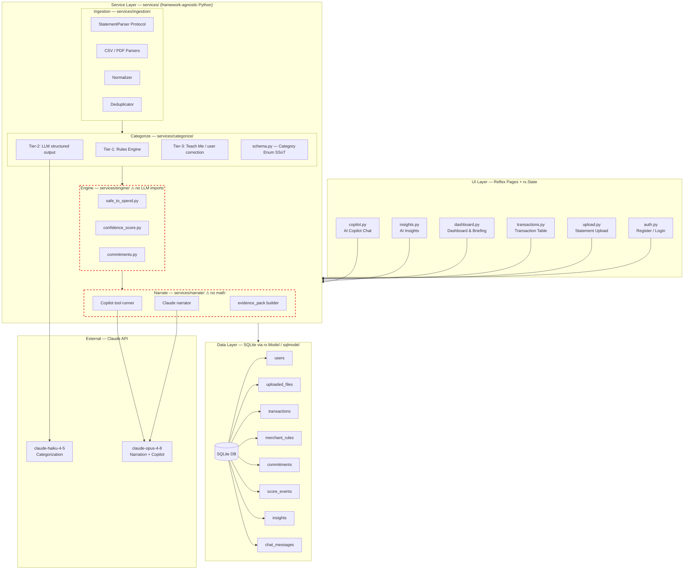
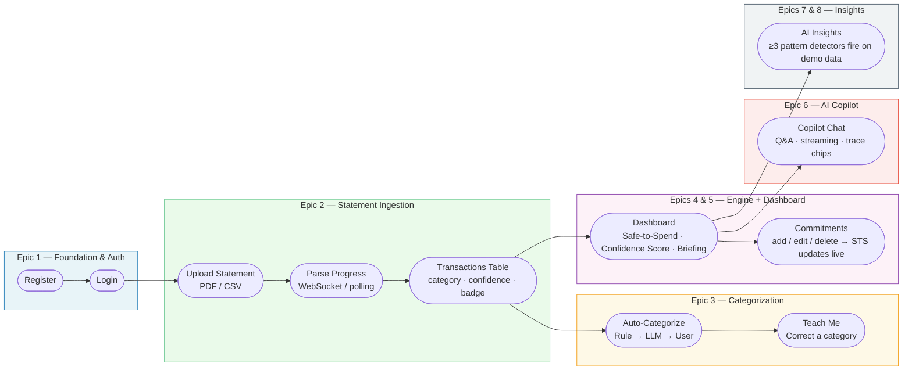
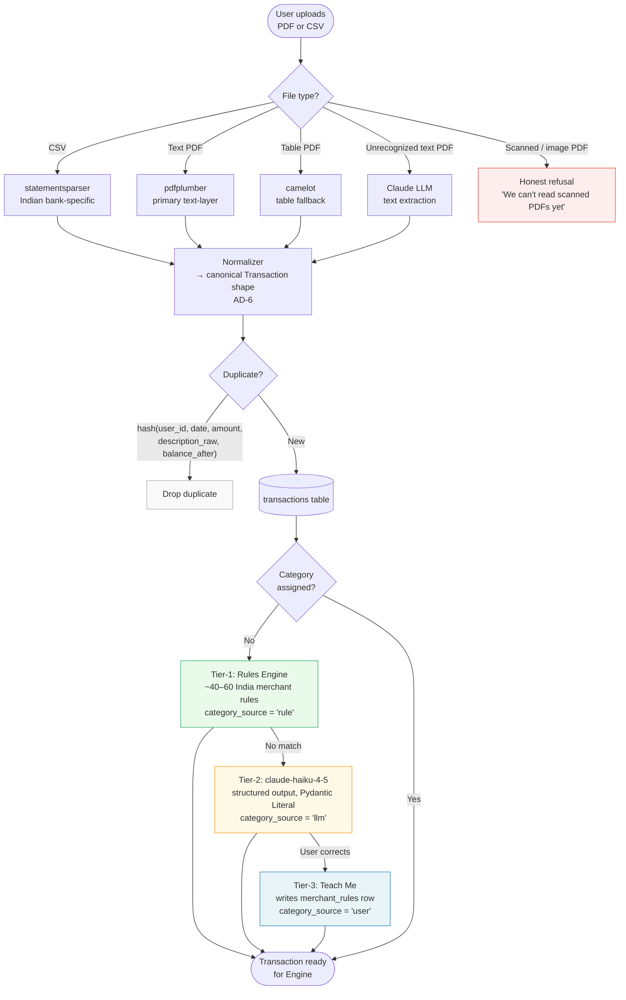
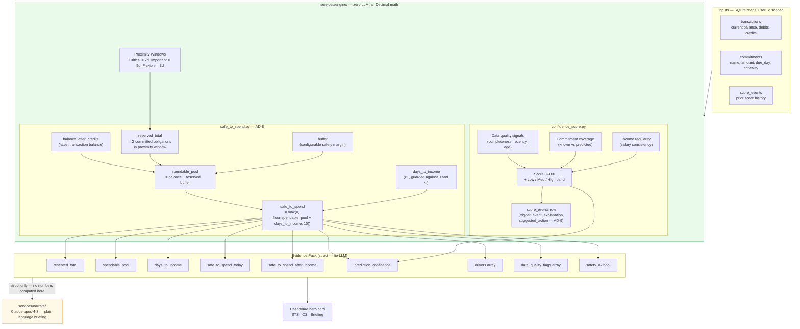
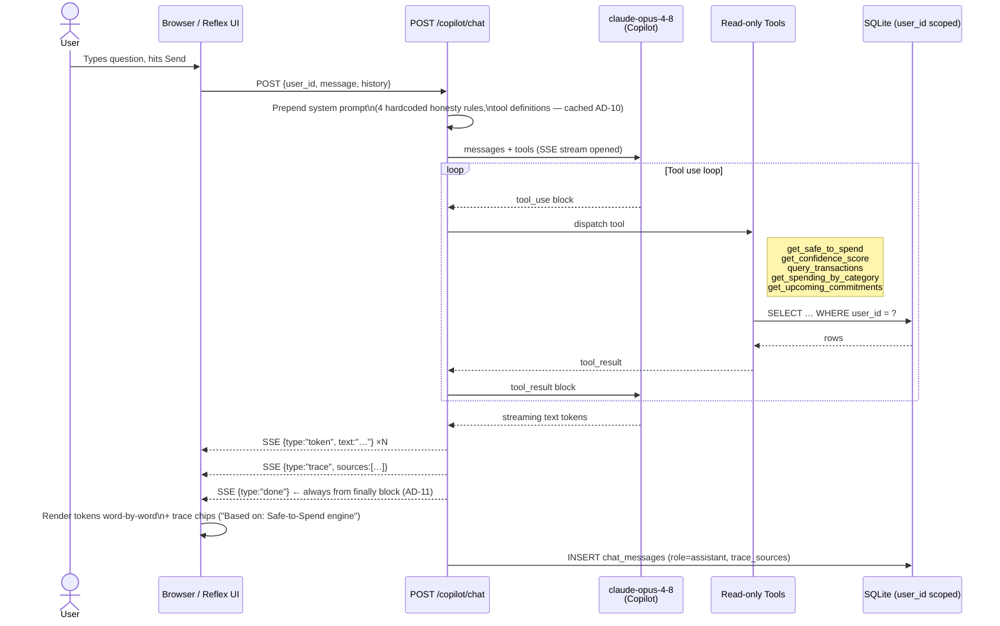
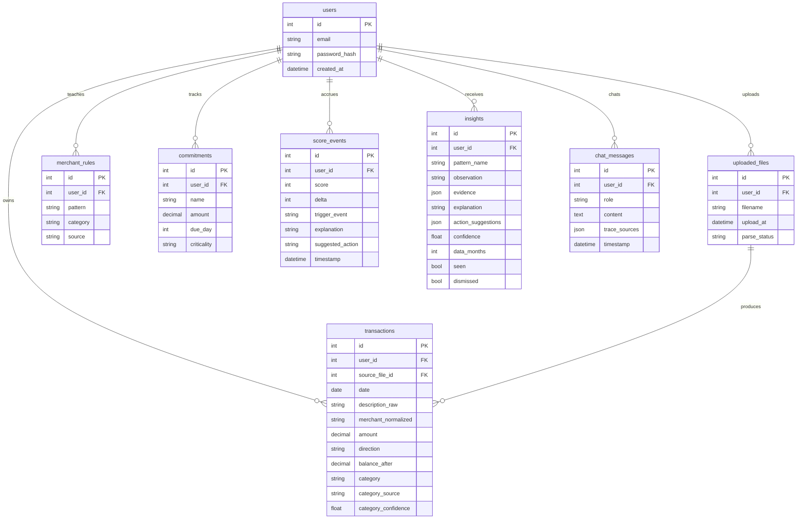
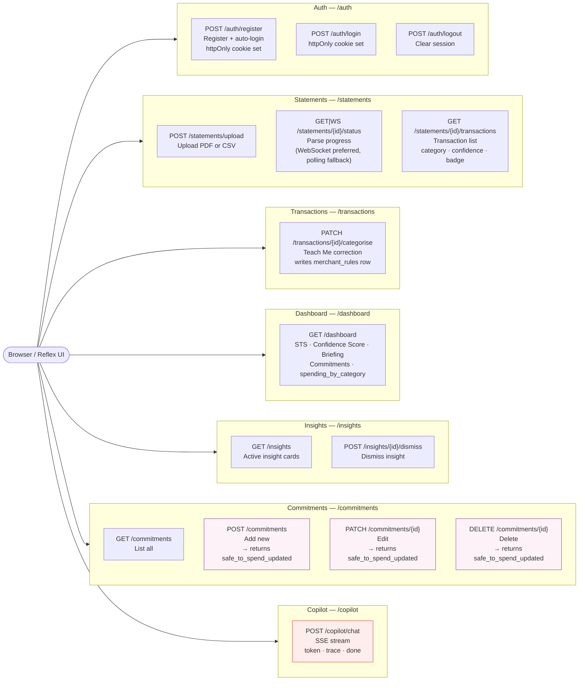
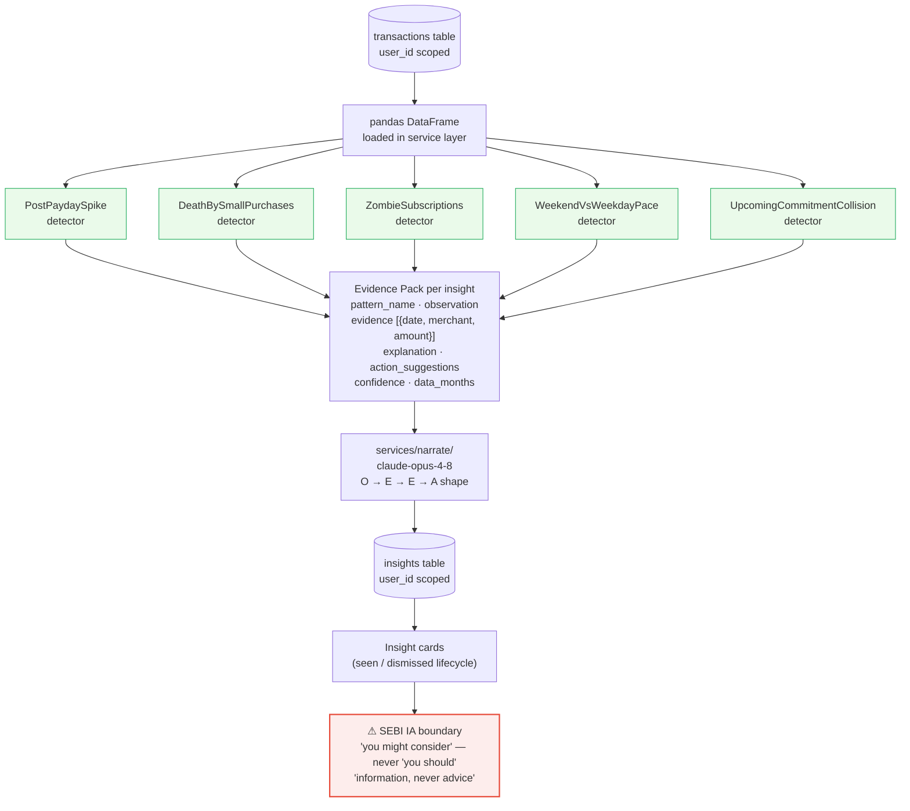
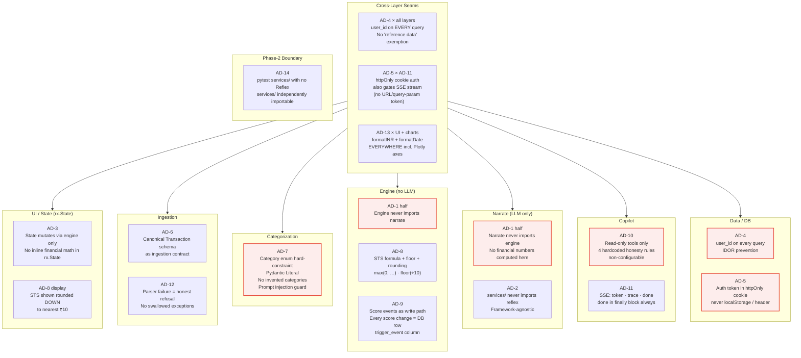

# AI-Powered Personal Finance Analyzer — Mermaid Diagrams

Eight diagrams covering every major system dimension: architecture, user journey, data pipelines, the financial engine, the AI copilot, the database schema, the API surface, and the 3-day build plan.

---

## 1. System Architecture Overview

Layered monolith with ports-and-adapters at both external edges (statement parsers and LLM calls). The Engine/Narrate boundary is the core invariant: no financial number originates in the narrate layer.

---

## 2. User Journey — Golden Path (MVP)

The committed end-to-end flow: upload → understand → act. Every step maps to an Epic.

---

## 3. Statement Ingestion Pipeline

Ports-and-adapters pattern. Every parser normalizes to the canonical Transaction schema before any downstream processing touches it.

---

## 4. Financial Engine — Safe-to-Spend & Confidence Score

The engine is the only source of truth for every financial number. It is fully deterministic (no LLM), fully unit-tested, and produces an evidence pack that the narrate layer receives as a struct.

---

## 5. AI Copilot — Request / Response Flow

The Copilot is strictly read-only. Four hardcoded honesty rules are non-configurable in the system prompt. The SSE `done` event fires from a `finally` block — the browser EventSource never hangs.

---

## 6. Database Entity Relationship Diagram

All 8 tables. Every table except `users` carries a `user_id` foreign key — no cross-user data leakage (AD-4).

---

## 7. API Surface Map

13 canonical endpoints organized by domain. Every write endpoint that touches commitments returns `safe_to_spend_updated` to avoid a redundant fetch.

---

## 8. 3-Day MVP Build Timeline — Epics & Stories

Epics are ordered by dependency. P0 stories are non-negotiable. Never-cut items are marked ★.

```mermaid
gantt
    title 3-Day MVP Build — AI-Powered Personal Finance Analyzer
    dateFormat  D
    axisFormat  Day %d

    section Day 1 — Foundation
    E1 Foundation & Auth (P0)        :crit, e1, 1, 1d
    E2 Statement Ingestion (P0)      :crit, e2, after e1, 1d
    E3 Categorization (P0)           :e3, after e2, 0.5d

    section Day 2 — Engine & UX
    E4 Financial Engine STS+CS (P0)★ :crit, e4, 2, 0.5d
    E5 Dashboard & Briefing (P0/P1)  :e5, after e4, 0.5d
    E7 Commitments Management (P1)   :e7, after e5, 0.5d
    E3 Categorization continued      :e3b, after e4, 0.5d

    section Day 3 — AI & Hardening
    E6 AI Copilot (P0/P1 must-ship)★ :crit, e6, 3, 0.75d
    E8 Proactive Insights (P1)★      :e8, 3, 0.75d
    E9 Hardening & Demo-Readiness    :e9, after e6, 0.5d
```

---

## 9. Proactive Insights — Detection Pipeline

Five deterministic pandas detectors. Each emits an evidence pack; the narrate layer adds language. SEBI IA boundary enforced at every output.

---

## 10. Architecture Decision Map — Hard Boundaries

Visual summary of the 14 ADs and the two cross-cutting seams that span multiple layers.

